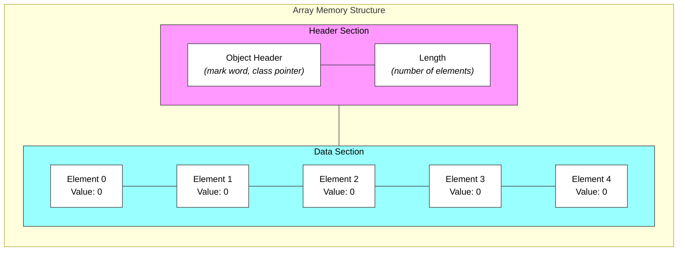
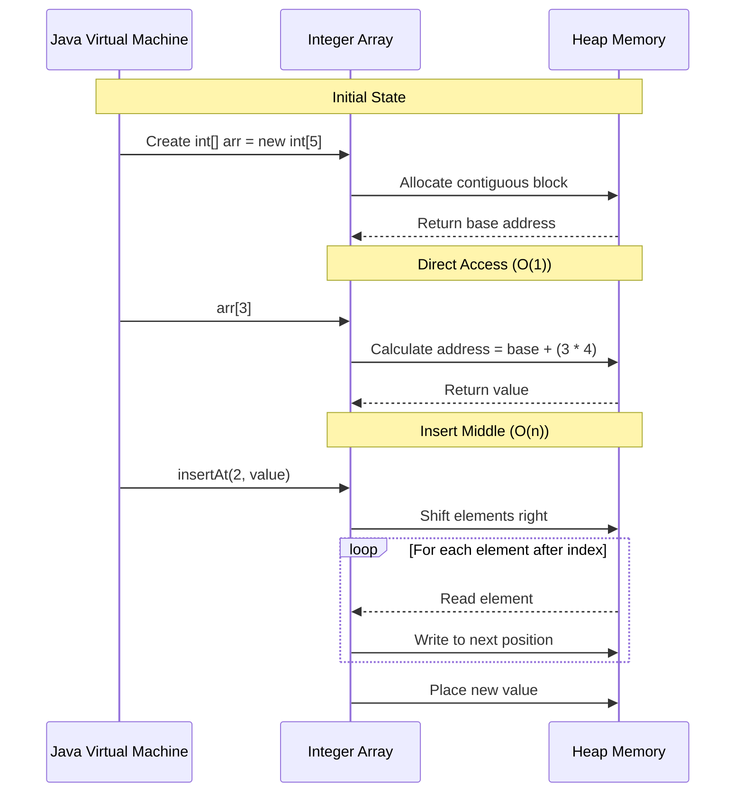

## Array

Arrays in Java are fundamental data structures that allow storing multiple values of the same type in contiguous memory locations.

#### Formal Definition and Basic Concepts

An array is a collection of elements of the same data type stored in adjacent memory locations. Key characteristics include:

- Homogeneous data (all elements must be of the same type)
- Fixed size once created (can't change it during runtime)
- Zero-based indexing (starts at index 0)
- Continuous memory allocation

## Memory Representation



In this memory layout:

- The Header Section contains metadata about the array, including its length and object information
- The Data Section stores actual elements in contiguous memory locations
- Each element is initialized to zero (or null for reference types) when created
- Elements are stored sequentially, allowing for fast access using index calculations

### Types of Arrays and Examples

Character Array

```java
char[] charArray = {'a', 'b', 'c'};
// Each character occupies 2 bytes in memory
charArray[0] = 'a';  // Index 0
charArray[1] = 'b';  // Index 1
charArray[2] = 'c';  // Index 2
```

Integer Array

```java
int[] intArray = {1, 2, 3};
// Each integer occupies 4 bytes in memory
intArray[0] = 1; // Index 0
intArray[1] = 2; // Index 1
intArray[2] = 3; // Index 2
```

String Array (Reference Type)

```java
String[] stringArray = {"hello", "world"};
// Each element stores a reference to String objects
stringArray[0] = "hello"; // Index 0
stringArray[1] = "world"; // Index 1
```

#### Why We Use Arrays

**Efficient Data Organization**

- Store multiple elements of the same type
- Access elements quickly using indices
- Manage related data effectively

**Memory Efficiency**

- Elements stored in contiguous locations
- Fixed size prevents memory fragmentation
- Predictable memory usage

**Performance Benefits**

- Constant-time access (O(1)) to elements
- Efficient memory management
- Good cache locality

#### Advantages and Disadvantages

Advantages:

- Fast access time (O(1))
- Straightforward memory management
- Structured data organization
- Cache-friendly performance

Disadvantages:

- Fixed size after creation
- Type homogeneity requirement
- Costly insertion/deletion in middle
- Memory waste if size is overestimated

#### Important Considerations

**Memory Allocation**
Arrays are stored in heap memory and each primitive type has specific size requirements:

- int: 4 bytes per element
- char: 2 bytes per element
- boolean: 1 byte per element

Understanding the space and time complexity of array operations is crucial for technical interviews. Let's break down the key operations and their complexities:

#### Basic Array Operations Complexities

| Operation               | Time Complexity | Space Complexity | Explanation                                    |
| ----------------------- | --------------- | ---------------- | ---------------------------------------------- |
| Access by Index         | O(1)            | O(1)             | Direct memory access using index calculation   |
| Search (Linear)         | O(n)            | O(1)             | Must potentially check every element           |
| Insert/Delete at End    | O(1)\*          | O(n)\*\*         | \*Only if space exists<br>\*\*If resize needed |
| Insert/Delete at Middle | O(n)            | O(n)\*\*         | Must shift elements                            |
| Sort                    | O(n log n)      | O(log n)\*\*\*   | Depends on sorting algorithm                   |

Notes\* Assumes array has extra capacity<br>
** When array needs resizing<br>\*** For recursive algorithms like quicksort

### Memory Layout Impact


This memory layout explains why certain operations have specific complexities:

- Direct access is O(1) because we can calculate any element's address using: `base_address + (index * element_size)`
- Insertion/deletion requires shifting elements because of contiguous storage
- Memory allocation happens in chunks due to the header section

Visualization on how array operations affect memory layout:



The sequence diagram illustrates why array operations have their respective complexities:

- Direct access is O(1) because we only perform a single calculation and memory lookup
- Middle insertion is O(n) because we must:
  1. Shift all elements after the insertion point
  2. Update references for each shifted element
  3. Place the new element
